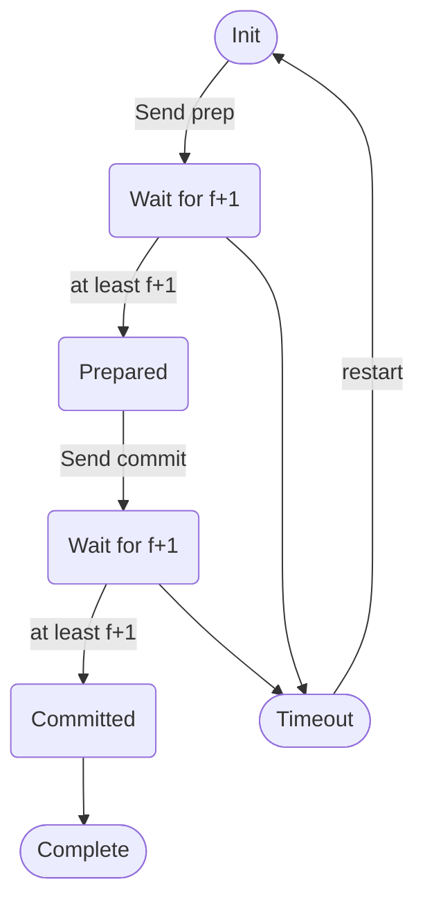

### Recoverability
- Atomicity (all-or-nothing) for updates involving a single server
- Atomicity (all-or-nothing) for updates involving more than one server (2 Phase Commit)
- **Availability and fault tolerance through replication (our focus)**
### Replicated State Machine Rules
- Rule #1: All replicas start in the same initial state
- Rule #2: Every replica apply **write operations in the same order**
- Rule #3: All operations must be deterministic
### RSM Failure Scenarios
- Primary crash (who will take over?)
- Multiple Primary (there can only be one or they will be inconsistency)
- Primary crash before sending all values, inconsistent replicas

## Paxos: Fault Tolerant Consensus
Machines agree despite:
- node failure
- network failure
- network delay/degradation

They mainly agree in 2 ways:
- Agree "X" node is the primary (election can be done using Paxos itself)
- "W" operation is the most recent operation to be executed.

What does agreement mean? How does it happen? (correctness)
- All nodes agree eventually on the same value
- Agree value must be proposed by some node

Fault Tolerance
-  If less than a fraction (N/2) of nodes fail, the rest should still reach agreement.
	- FLP theorem: impossible for a set of nodes in async system to agree on binary value, even if only 1 machine fails unexpectedly
	- Most networks are async.
	- So how can Paxos guarantee to reach consensus even in the presence of failures?
	- But Paxos doesnt guarantee the consensus process will terminate
	- This means consensus can just keep retrying until the node returns.

Node Roles
- Leader
- Acceptor (quorum)
- Learner

### Paxos Challenges
- 2 machines choose to be leader and solicit different values
- Leader crash before solicit
- Network partition: leader does not get majority (fault)
- leader crash after deciding but before announcing (re elect?)
- new leader decides a new value after the decision by a leader that crash
	- kinda similar to first challenge
	- inconsistency.
Paxos Solution

Order proposals by ID such as Machine ID #: Logical Clock

Each acceptor can accept multiple proposals, but reach eventual consensus by all higher proposal ID following the same value.
- does previously accepted proposal get rescinded?
- no it just will get "ignored" at the proposer when it receives prepare-ok for higher proposal numbers

Paxos Node State:
- Na: highest proposal ID# accepted
- Va: Accepted value for Na
- Nh: Highest proposal ID# seen
	- seen is not the same as accept
- myn: my proposal ID# in the current Paxos session
	- when does it change.

Three stage protocol
- Prepare: One or more proposer sends a message that it is preparing to become a leader and acceptors accept/reject proposals
	- a form of temporary election?
- Accept: Proposers that passes the prepare stage proposes values to acceptors and acceptors accept/rejects proposal values
- Decide: Proposer that passes the accept stage decides the final value and announces to learners

Prepare stage
potential proposer asks some nodes. they can reply:
- (prepare-ok, Na, Va): that was such a big number. im going to update my highest seen number (Nh)
	- why do we send Na, Va?
- (prepare-reject:) nah i seen a bigger one.
- depends on whether the other node has seen a higher number
- represents a promise that the acceptor will not respond to any other proposal less than myn.

Accept Stage.(proposer: plz accept plz)
Proposer previously did not include a value, but if it receives (prepare-ok) from a majority it can decide a value. it chooses value of the highest proposal ID it saw.

- send (accept, myn, Va) to those who replied with (prepare-ok)
- acceptors reply (accept-ok) if proposal ID is bigger than what they've seen (same as before)
- if not they reply (accept-reject)

Decide Stage
After receiving accept-ok from a majority of acceptors, the proposer decides the value and sends to all learners.

### Paxos Properties
1. Proposal numbers are unique
2. Any 2 sets of acceptors have at least 1 common acceptor. Why?
3. The value sent out in the accept stage is the value of the highest number proposal ID# of all the responses in the prepare stage
PAD
prepare
accept
decide.

Challenge 1