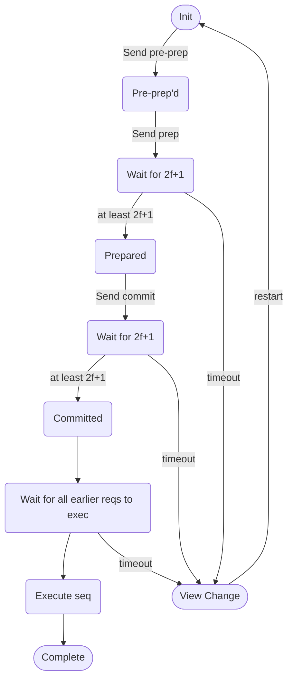

## Objective
- Ensure safety and liveness despite network asynchrony
	- Establish a total order of execution of requests coming from clients (pre-prepare and prepare)
	- Ensure requests are observed consistently across views (commit)
		- View is a configuration of replica with primary (view#  mod N)
- Other replicas monitor the primary and perform a view change if the primary fails

PBFT uses 3f +1 nodes - why?
- at most f nodes can fail. leaving 2f + 1. but there must still be liveness aka good things must happen/progress. so u still need at least f + 1 acceptors to progress.
- some Clients, Primary and several replicas.
- 3 stages
	- pre-prepare
		- Acknowledge a unique sequence number for the request (from client)
	- prepare
		- The replicas to agree on a unique sequence number for the request (from client)
	- commit
		- Establish total order in all replicas

### PBFT state of replica
- A replica ID “i” (between 0 and N-1)
- A view number v#, initially 0
- A primary replica
	- ID of primary replica: v# mod N

- A log of <op, seq#, status> entries
	- op: the operation/request
	- seq#: a sequence number identifying the operation
	- Status: pre-prepared, prepared or committed 
### Pre-prepare stage
Goal:
- Acknowledge a unique sequence number for the request (from client)
Send process:
- Client request from primary. 
- Primary assign sequence number and sends <pre-prepare, v#, seq#, op>
- Record operations in the log
- Malicious primary can send different seq# for the same op
- or use a duplicate seq#
Receive process:
- check v# and seq# valid.
	- no dupes or skips
- accept or drop

### Prepare Stage
Goal:
- The replicas to agree on a unique sequence number for the request (from client)

Send:
- Replicas send prepare message to all other replicas including primary
- <prepare, i#, v#, seq#, op>

Receive:
- check v# and seq# again 
- from each replica pov, can only proceed to next stage aka mark as prepared when 2f+1 (including self vote) distinct, valid and matching prepare messages are received.
- record in log as prepared

Guarantee: 2 diff requests (from client) will never have same seq#, since 
- non faulty replicas agree on seq# in prepare stage
- non faulty replicas agree on total order for requests within a view v# (same view)
- doesnt guarantee clients will observe the same total order.
- we need the final commit stage.
### Commit stage
Goal:
- Establish total order in all replicas. so all replicas can execute operations in the same order
Send:
- Send commit messages to all 
- Each commit message contains <i, v#, seq#, op> for replica “i”
- Each replica send the commit to all other replicas

Receive:
- Check the validity of v# and seq# as pre-prepare and prepare stage

Guarantee: 
- Valid (pre-prepare) for “op” is received
- "prepared" was recorded in the log
- 2f+1 (including self-vote) distinct, valid and matching commit messages (i.e. with the same seq# and v#) received
	- Thus continues with at most “f” byzantine failures
	- The operation is recorded in the log as "committed"
- Commit stage guarantees a consensus among the non-malicious replicas regarding the value for the agreed seq# in the prepare stage

### Execute stage
A replica executes request op iff
- committed stage succeeds (check log)
- all requests with lower seq# are already executed
- reply primary
- Primary replies client if receive f+1 executed

### View Change (byzantine primary)
- What happens when the primary fails (malicious tampering)
	- replicas may not be able to execute due to wrong (skip/duped) seq# number
	- replicas may never get the request to execute
- Replicas start a timer for each request it receives
	- if timer expires, replica requests for a view change i.e. change primary
	- While changing view, the replica does not accept any normal message (e.g. pre-prepare, prepare and commit)
	- timer is renewed at each stage

Case of byzantine primary (slide 10 bft2):

1. Let us assume that Replica 1 received all the requests, i.e. op1, op2, op4, op5 with sequence numbers 1,2,4 and 5 respectively.

2. If Replica 1 is honest, it will have matching prepare messages for all sequence numbers in Replica 2 as well as for all sequence numbers in Replica 3. Note that Replica 1 got all the sequence numbers.

3. The primary is byzantine, thus, it will prepare arbitrary messages with arbitrary sequence numbers. In short, it is capable to craft and send matching prepare messages for all sequence numbers in Replica 2 as well as for all sequence numbers in Replica 3.

4. Now, Replica 2 has three different matching responses (including itself), thus validating 2f+1 matching replies

5. Similarly, Replica 3 also has three different matching responses (including itself), thus validating 2f+1 matching replies

6. Despite having 2f+1 matching responses from other replicas, both Replica 2 and Replica 3 will prepare different sequence of messages (1,4,5 for Replica 2 and 1,2,5 for Replica 3).

7. This finishes the scenario.

This is a problem of diff seq numbers on diff replicas. so we will need to merge them and turn missing numbers into no ops

- Consider the two view-change messages received by the new primary
	- (view-change, seq1: x = 1, seq4: y = 4, seq5: z = 5 )
	- (view-change, seq20000000: x = 3, seq4: y = 4, seq5: z = 5 )
- The malicious primary can choose an arbitrary high sequence number
	- This may end up in many no-operation requests
- Sequence numbers are bounded by [min, max]

View-Change Initiation:
- Each replica that times out initiates a view change message to all other replicas
	- New v# = (old v# + 1) mod N ( so that it loops back)
	- includes list of requests that are prepared (may or may not be committed)
	- The list of prepared messages have 2f+1 matching replies from other replicas (possibly including itself)

Receive:
- The new primary waits for 2f+1 (possibly including self) view-change messages
	- Declare itself as the new primary
	- Construct a list of pre-prepare messages to restart the normal operation of PBFT in a new view
	- broadcast
- each replica receives the view change, thus it checks validity of pre-pared messages locally
- if validity check fails, repeat.
Another Problem: Byzantine primary doesn't forward requests.
- client times out and broadcasts request to all replicas
- replicas time out if primary doesn't reply

Exercise: Assume a byzantine primary in the network of 7 replicas (including the primary). Assume the primary sends 7 different sequence numbers (as part of (pre-prepare) message) to the replicas for the same request from the client. Explain the consequences in the context of the PBFT protocol. How such a problem can be resolved if you use PBFT?

Ans: In this case, we note that the replicas will not get matching prepare messages (as the sequence numbers of the replicas differ). All replicas will face the same situation (i.e. waiting for 2f+1 matching prepare messages) leading to timeout.

- All replicas after the timeout will initiate a view change request. After the new primary (if not faulty) receives 2f+1 view change messages, it will initiate (new-view) message and initiate the PBFT session with new pre-prepare messages. Given that the new primary is non-faulty, these sequence numbers for the pre-prepare messages will be coherent across all replicas. If the new primary is also faulty, the view change cycle will continue until a non-faulty primary is found.

### Correctness/Consistency
what happens to the old commits in previous view# when we change views?
- PBFT commit stage guarantees consistency across views
- Observation #1: A request will be re-committed in the view change if it is included in at least one of the view-change message
- Observation #2: A committed request means that at least 2f+1 commit messages are seen
	- this means at least f+1 non-faulty replicas have prepared the message (as there could be at most “f” faulty replicas)
- Observation #3: 2f+1 view-change messages are required for a new-view

- Using Pigeon-hole principle, from observation #2 and #3, we can conclude that there exists at least one non-faulty replica that prepared a request in the previous view AND sent a view-change message (as (2f+1)+(f+1) > 3f + 1)
- Therefore, any arbitrary commit, prepared in a view, will also be re-committed in the next view after the view change
	- This guarantees consistency of commits across views
- We need 3 stages
	- With only 2 stages, it is not possible to guarantee that if a request is committed, then it was prepared by a majority of non-faulty replicas.
	- it is possible that a committed request will not be re-committed in the next view (violating correctness)

Unsolved Problems:
- totally spammable view change. (DOS)