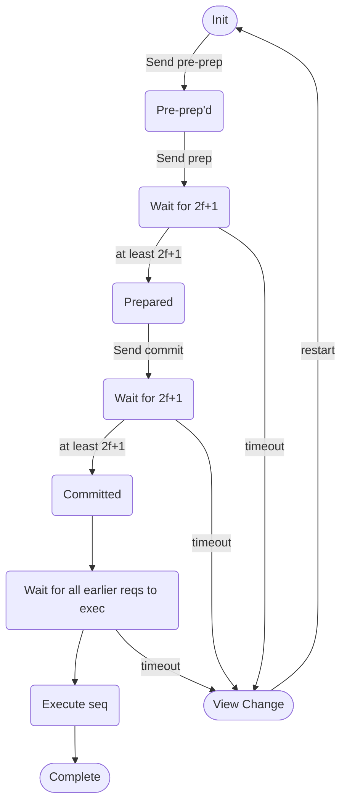

![[Screenshot 2023-12-11 at 9.50.00 PM.png]]

how come we cant order it as P1 -> P4 -> P2 -> P3

```mermaid
flowchart TD
  init([Init])-->|Send pre-prep|pp(Pre-prep'd)
  pp-->|Send prep|wpp(Wait for 2f+1)
  wpp-->|at least 2f+1|p(Prepared)
  p-->|Send commit|wp(Wait for 2f+1)
  wp-->|at least 2f+1|c(Committed)
  c-->wait(Wait for all earlier reqs to exec)
  wait-->exec(Execute seq)
  exec-->fin([Complete])
  wpp-->|timeout|vc([View Change])
  wp-->|timeout|vc
  wait-->|timeout|vc
  vc-->|restart|init
```

where does pre-prepare come from